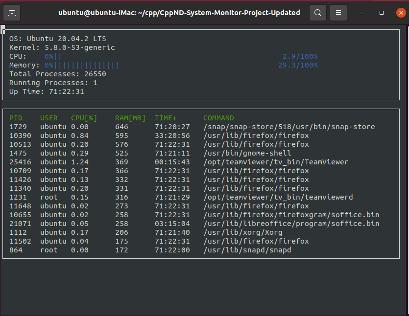

# CppND-System-Monitor

This project is part of the C++ nanodegreee program at Udacity. It is a linux monitoring tool (that executes on the terminal) similar to htop. A screenshot of the final output is below:

